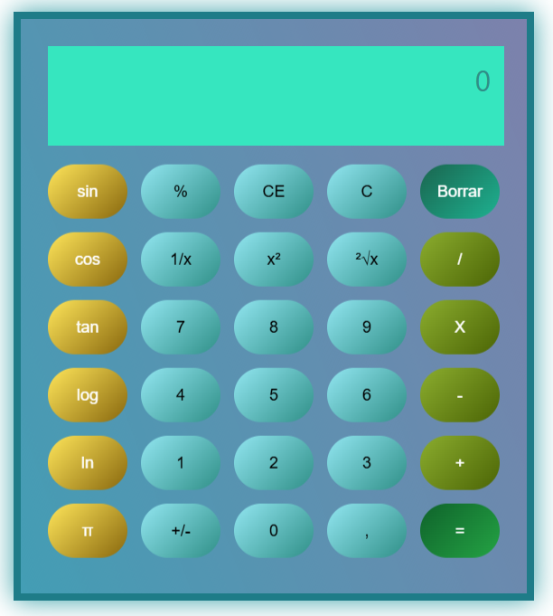

# 🧮 Scientific Calculator

An advanced calculator built with React that includes common and scientific mathematical functions — perfect for students, professionals, and tech enthusiasts.

## 🚀 Features

- Basic operations: addition, subtraction, multiplication, division.
- Scientific functions:
  - Trigonometric: `sin`, `cos`, `tan`
  - Logarithmic: `log`, `ln`
  - Square root, square, inverse (`1/x`)
  - Percentage
  - Constants: `π`, `e`
- Toggle sign (`+/-`)
- Decimal point support
- Clear (`C`) and backspace (`Borrar`) buttons
- Button click sound 🎵
  
## 📸 Preview



---

## 🛠️ Technologies Used

- React (useState, useEffect)
- Modern JavaScript (ES6+)
- CSS for styling
- HTML5
- Local sound file (`click-sound.mp3`)

## 📦 Installation

1. Clone the repository:

   ```bash
   git clone https://github.com/AdesKitty/scientific-calculator.git
   cd scientific-calculator
